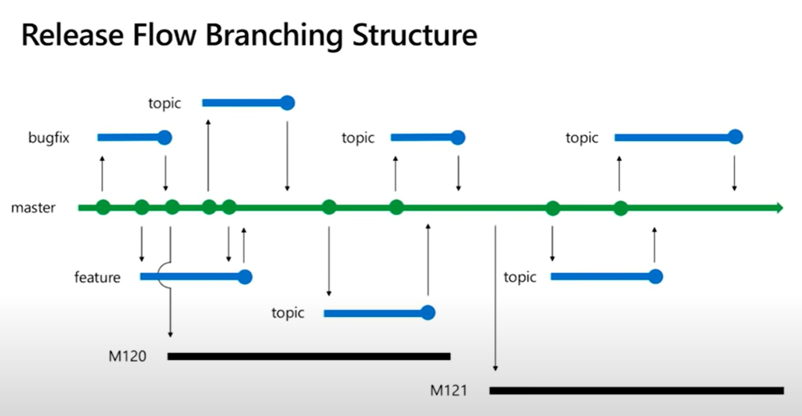

# Takeaways

Massive downside to "big bang" merges. They had a main branch for releases, and each group had their own "super branch". Code sharing was done through merging the group branches into the main branch and then merge it back from the main branch into the different group branches. This led to quite a few merge conflicts and issues.

They went so far as to create a subgroup branch, holding the same merge patterns as the group had towards main. They went even further and created feature branches for the sub group branches and hot fixes for the main branch and release branches(!).
Summary: **Do not do this!**

![[Visual_studio_bad_branching.png]]

## Trunk Based
They generally recommend *Trunk-Based strategy*. Reduce merge conflicts. Code review is easier and pull request are encouraged due to the smaller incremental changes.
Feature branches are like an integration credit card, it needs to be paid back. Instead use feature flags to enable/disable features for end users.

![[Visual_studio_trunk_branching.png]]

## GitHub Flow

^dc1fa5

Trunk based are often confused with GitHub flow. The latter is similar, but it adds a subtle level of complexity, namely that GitHub pushes their pull requests to production before they merge it(?).
This happens through mergin master into the pull request and then deploying the pull request into production. The pull request is then completed and merged into master.
GitHub Flow locks the master branch before the merge into the branch. Build is done. Might do a canary deployment. There is then a deployment to production and monitoring for problems. Lastly the pull request is merged into master, and master branch is unlocked.

*The GitHub Flow is recommended for continuous deployment*.
Downside is that it does not scale too well, all test will have to be run for all pull requests and that keeps the master branch locked for others while your tests are running. Stopped working around a 150+ per month, solved using their chat robot to keep a queue system.

![[Visual_studio_github_flow.png]]

## Release flow branching structure

This is the strategy that the visual studio team follows. Deployments are done at the end of sprints instead of having deployments happen whenever a developer finishes some changes.
*Whenever a sprint is finished, they create a new branch which is then deployed to production.*

M120 represents a finished and deployed sprint. Once a new spring, M121, is done the old M120 branch is thrown away as the new one is deployed to production.

They do not deploy master to production in order to have the opportunity to fix bugs that have made it into the sprint release.

When a bug is detected they create a new branch from master, fixes the bug and merges it back into master. The pull request that holds the fix is then also copied/merged into the released branch. Illustrated by the highlighted topic branch on the right hand side:
![[visual_studio_release_flow_with_bug.png]]

They do it this way, which is a bit slower than the alternatives of fixing directly against release, because it ensures that they always have this change in master and that it becomes part of future sprint releases. Important since the sprint release branches gets blown away once the next sprint is released.

# Concepts to look up

- Conways Law: *Organizations which design systems [..] are constrained to produce designs which are copies of the communication structures of these organizations.* (We build and ship the org. charts.)

- Feature flags.

- GitHub Flow - difference between this and Trunk based.

**Source:** [Git patterns and anti-patterns for successful developers : Build 2018 - YouTube](https://www.youtube.com/watch?v=ykZbBD-CmP8&list=WL&index=3)
[Release Flow: How We Do Branching on the VSTS Team - Azure DevOps Blog (microsoft.com)](https://devblogs.microsoft.com/devops/release-flow-how-we-do-branching-on-the-vsts-team/)

**Tags:** #git #github #sourcecontrol 