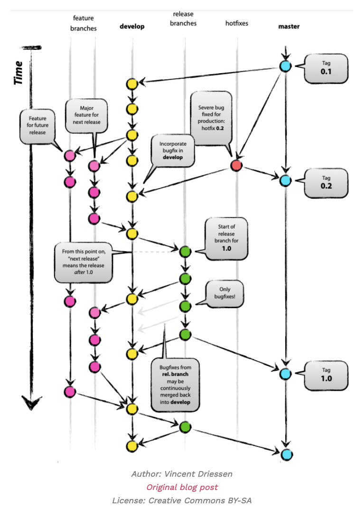

An advance strategy best suited to handling a varying set of release versions.

One of the "authors" of this strategy are now warning against using it without a good reason.
Blog post on the subject (not read as of now) [A successful Git branching model » nvie.com](https://nvie.com/posts/a-successful-git-branching-model/) ^b65369

## Branches
- Main
- Development
- Feature
- Release - a production relase. Branched from development, bug fixes are continuously merged back into development.
- Hotfix - The existence of dedicated hotfix branch allows developers to work on their own changes while the bug is fixed.

With such a setup the main and the development branch is considered to be the only permanent branches, while the others are temporal and only exists to serve a purpose.
Main branch remains stable for release throughout the development cycle.
The sea of branches might get in way of CI/CD as developers drown in commits.
It is a rigid structure not always suited to the problem/project and might be a bit too much. Best suited for larger projects with multiple releases and larger teams?

1. Many many branches
2. Madness level is "Send me to mental institution"
3. Requires release management

Tags: #github #branching #cicd #git 